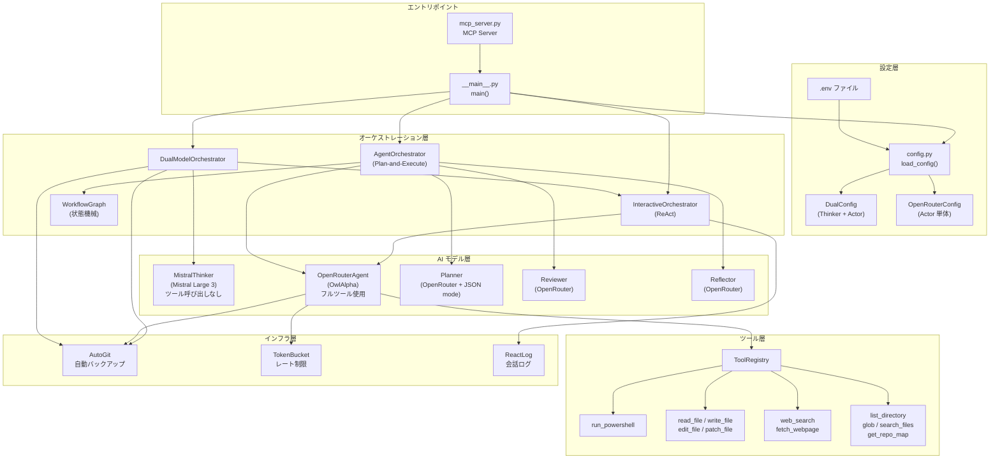
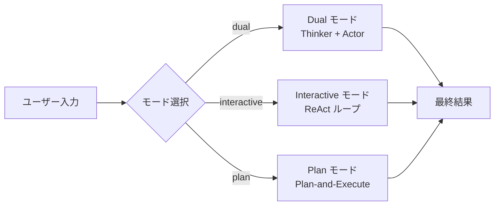
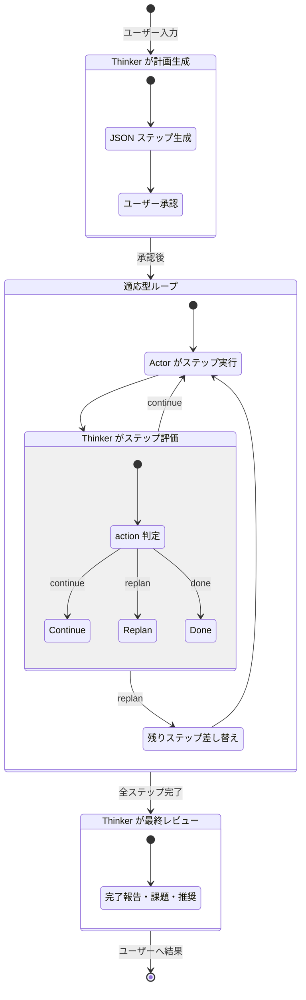
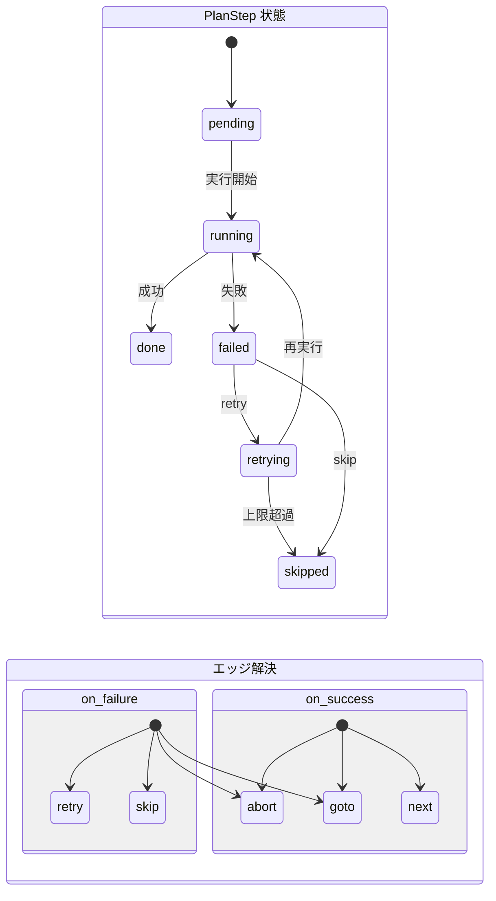
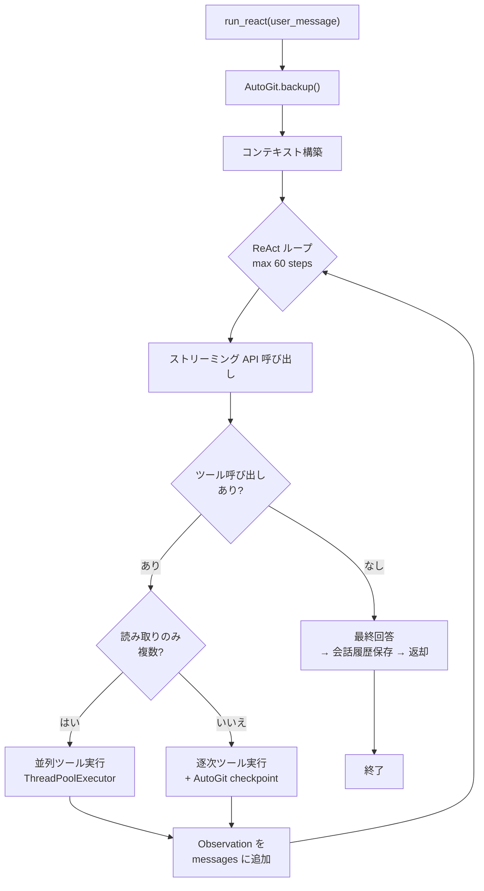
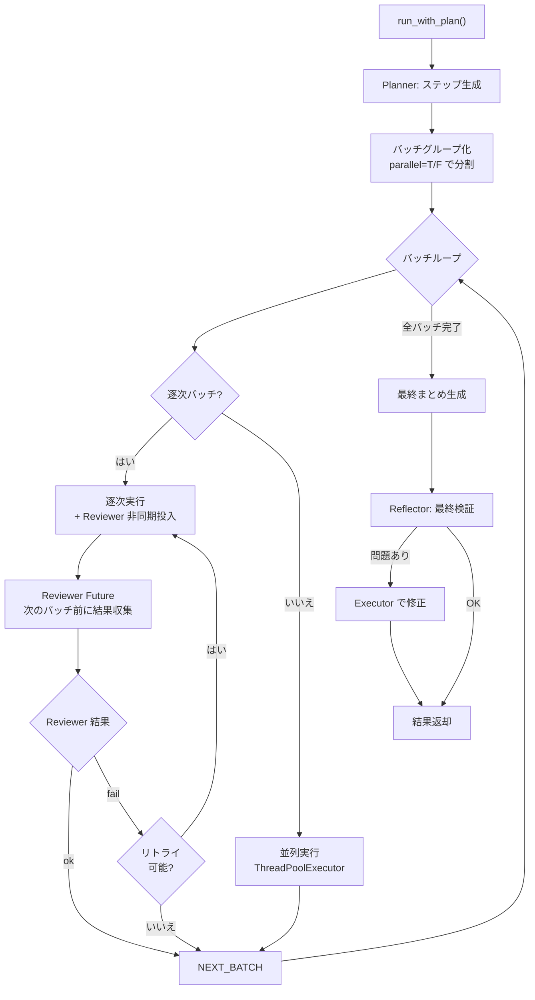
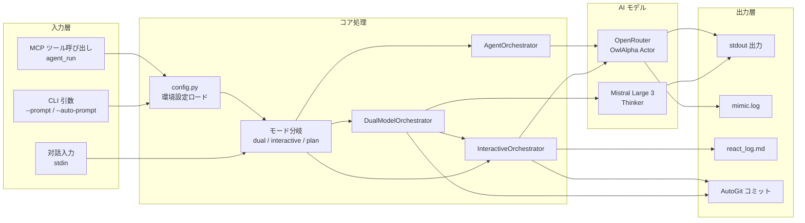
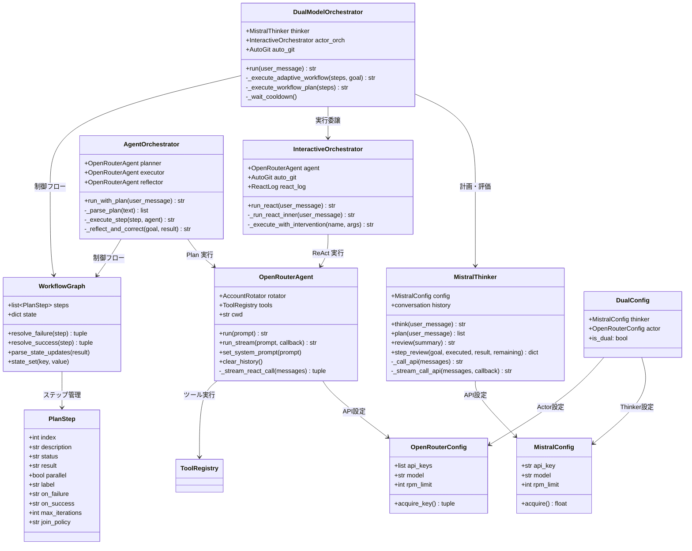

# Mimic3 システムアーキテクチャ

## 1. 全体アーキテクチャ（Mermaid）



## 2. 3つの実行モード



## 3. DualModelOrchestrator 協調ロジック（シーケンス図）

```mermaid
sequenceDiagram
    autonumber
    participant U as ユーザー
    participant DMO as DualModelOrchestrator
    participant MT as MistralThinker
    participant IO as InteractiveOrchestrator
    participant OA as OpenRouterActor
    participant AG as AutoGit
    participant WG as WorkflowGraph

    U->>DMO: run(user_message)

    rect rgb(173, 216, 230)
        Note over DMO,MT: Phase 1: 計画生成
        DMO->>MT: plan(user_message)
        MT-->>DMO: steps JSON
        DMO->>U: 計画表示 (Step 1..N)
        U->>DMO: 承認 [y/N]
    end

    rect rgb(144, 238, 144)
        Note over DMO,OA,MT: Phase 2: 適応型ワークフロー実行
        loop 各ステップ (remaining が空になるまで)
            DMO->>OA: run_react(step.description)
            OA->>AG: backup(cwd)
            OA-->>DMO: step_result
            DMO->>WG: parse_state_updates(result)

            alt ステップ失敗
                DMO->>WG: resolve_failure()
                alt retry
                    DMO->>OA: 再実行
                alt skip
                    Note over DMO: 次ステップへ
                alt abort
                    DMO-->>U: 中断
                alt goto:label
                    DMO->>DMO: ジャンプ先へ
                end
            end

            alt ステップ成功
                DMO->>WG: resolve_success()
                alt goto:label
                    DMO->>DMO: ジャンプ先へ
                end
            end

            rect rgb(255, 255, 224)
                Note over DMO,MT: Thinker ステップ評価
                DMO->>MT: step_review(goal, executed, result, remaining)
                MT-->>DMO: decision JSON
                alt action=continue
                    Note over DMO: 残りをそのまま続行
                alt action=replan
                    DMO->>MT: 新計画で remaining を差し替え
                    Note over DMO: replan_count++
                alt action=done
                    DMO->>DMO: ループ終了
                end
            end
        end
    end

    rect rgb(255, 228, 225)
        Note over DMO,MT: Phase 3: 最終レビュー
        DMO->>MT: review(all_summaries)
        MT-->>DMO: レビューコメント
        DMO-->>U: 結果表示
    end
```

## 4. Thinker ↔ Actor 協調の詳細フロー



## 5. WorkflowGraph 状態遷移



## 6. ReAct ループ（InteractiveOrchestrator）



## 7. Plan-and-Execute ループ（AgentOrchestrator）



## 8. データフロー全体像



## 9. クラス関係図



## 10. ファイル構成と役割

```
mimic3/
├── __main__.py          # エントリポイント: 設定ロード・初期化・メインループ
├── main.py              # interactive_loop() / pipe_mode() / auto_mode()
├── config.py            # .env パーサー / DualConfig / OpenRouterConfig / MistralConfig
├── orchestrator.py      # DualModelOrchestrator / AgentOrchestrator / InteractiveOrchestrator / WorkflowGraph
├── thinker.py           # MistralThinker (Mistral Large 3 専用 Thinker)
├── agent.py             # OpenRouterAgent (ReAct ループ + ツール実行)
├── tools.py             # ToolRegistry (ツール定義・実行)
├── commands.py          # スラッシュコマンド (/mode, /think, /model, /cd, ...)
├── autogit.py           # AutoGit (自動バックアップ・チェックポイント)
├── mcp_server.py        # MCP Server (Claude Code 連携)
├── utils.py             # ユーティリティ (TokenBucket, safe_print, log, ...)
└── .env                 # API キー・モデル設定
```

## 11. Dual モード タイムライン図

```
ユーザー入力
    │
    ▼
┌─────────────────────────────────────────────────────────┐
│  Phase 1: 計画生成 (Thinker)                             │
│  ┌──────────┐    ┌──────────┐    ┌──────────┐          │
│  │ plan()   │───▶│ JSON生成 │───▶│ ユーザー │          │
│  │ (Mistral)│    │ (ストリーム)│   │ 承認[y/N]│          │
│  └──────────┘    └──────────┘    └──────────┘          │
└─────────────────────────────────────────────────────────┘
    │ 承認
    ▼
┌─────────────────────────────────────────────────────────┐
│  Phase 2: 適応型ワークフロー (AdaptiveWorkflow)          │
│                                                         │
│  ┌─────────┐   ┌─────────┐   ┌──────────────┐         │
│  │ Actor   │──▶│ Thinker │──▶│ action判定   │         │
│  │ 実行    │   │ step_   │   │ continue/    │         │
│  │(ReAct)  │   │ review()│   │ replan/done  │         │
│  └─────────┘   └─────────┘   └──────────────┘         │
│       ▲                            │                    │
│       │         replan時           │                    │
│       └────────────────────────────┘                    │
│  (WorkflowGraph: on_failure/on_success/goto 処理)       │
└─────────────────────────────────────────────────────────┘
    │ 全ステップ完了
    ▼
┌─────────────────────────────────────────────────────────┐
│  Phase 3: 最終レビュー (Thinker)                         │
│  ┌──────────┐    ┌──────────┐                          │
│  │ review() │───▶│ 完了報告 │──▶ ユーザーへ返却        │
│  │ (Mistral)│    │ 課題・推奨│                          │
│  └──────────┘    └──────────┘                          │
└─────────────────────────────────────────────────────────┘
```
